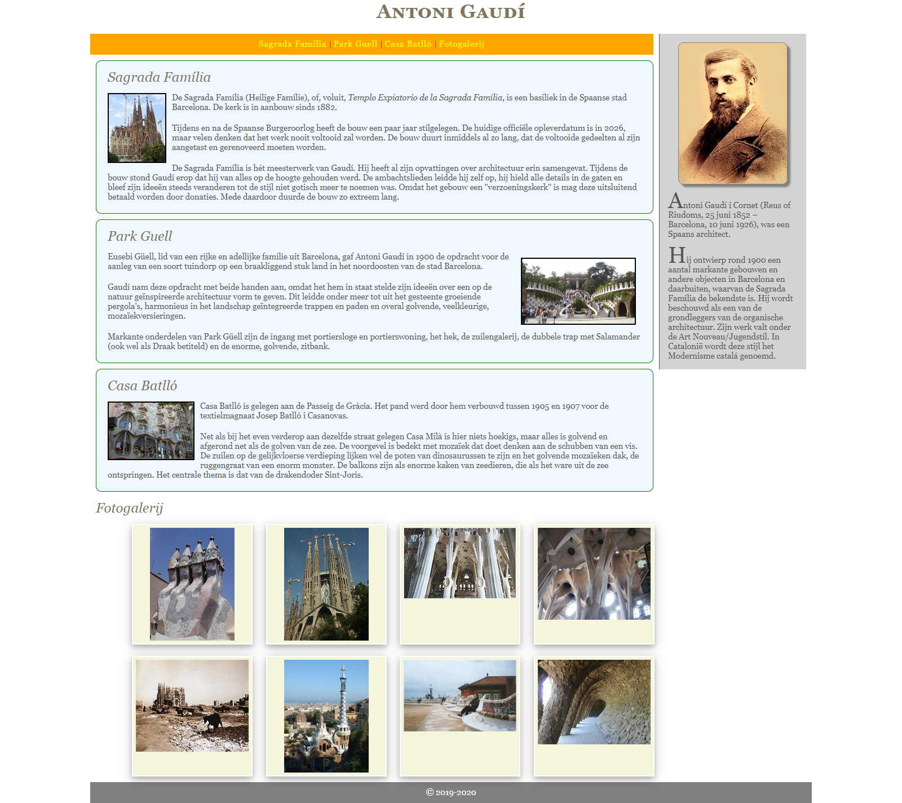
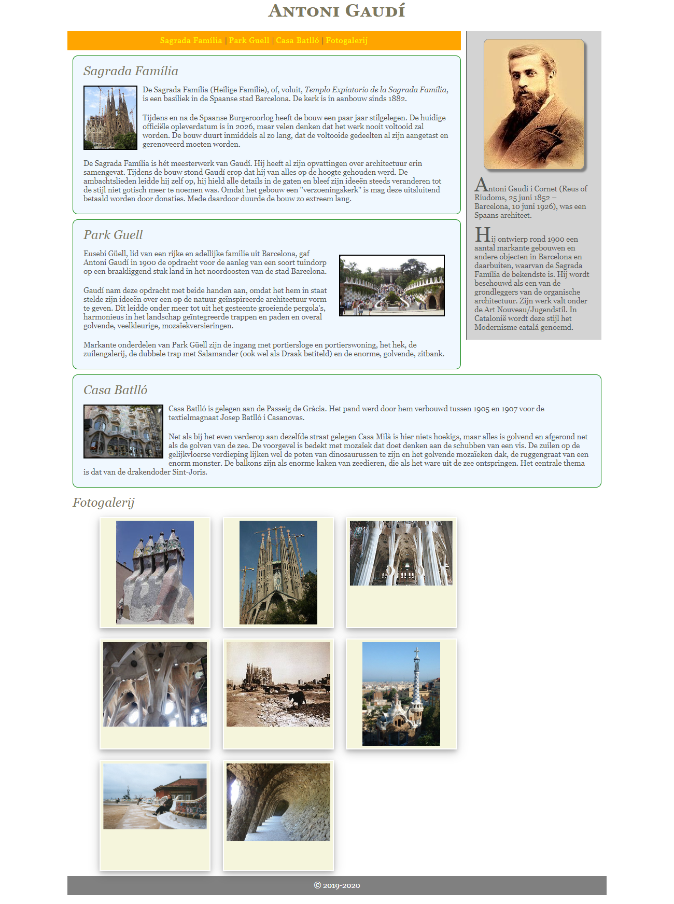

# oe-positionering-gaudi
Oefening maak Css vertrekkende van HTML-Pagina

# Opzet
Je krijgt ditmaal een RootFolder aangeleverd, maar de CSS ontbreekt. De bedoeling is dat je op basis van wat je tot hiertoe aanleerde de webpagina vormgeeft.

1. Maak een Fork van deze repo naar je eigen repository.
2. Clone de opdracht naar je PC
3. Werk de opdracht uit en push regelmatig naar je eigen repo

> ## Tips
> - Gebruikt lettertype : georgia
> - Voor de fotogalery is het misschien aangeraden iets met display te doen

## Op een andere resolutie
